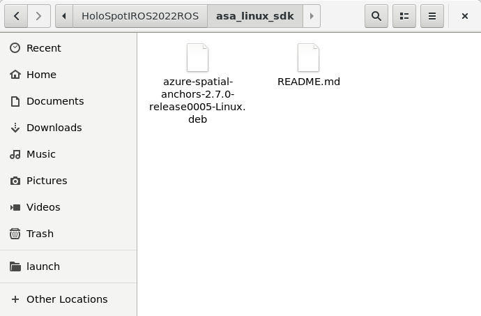
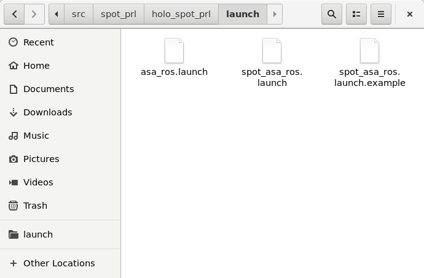
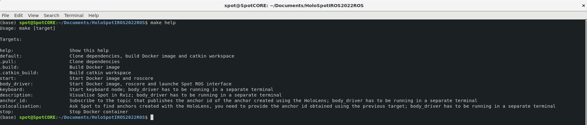
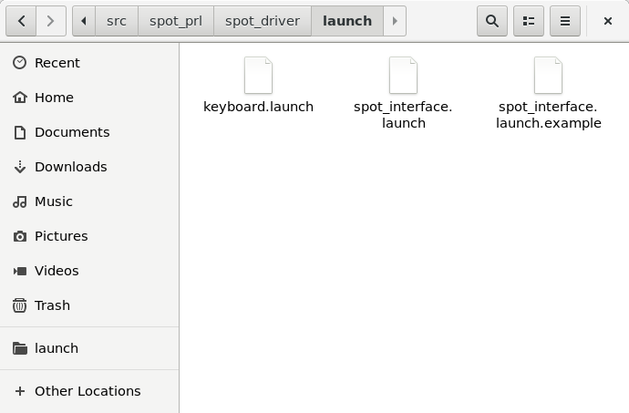
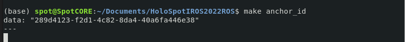
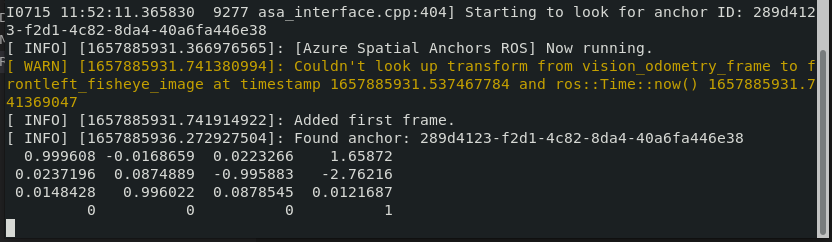

# Holo-Spot ROS packages

This repository builds a docker image aimed at running on SpotCore to colocalise Spot and the MS HoloLens through ROS.

## Prerequisites

* [Create a Spatial Anchors Resource](https://docs.microsoft.com/en-us/azure/spatial-anchors/quickstarts/get-started-unity-hololens?tabs=azure-portal#create-a-spatial-anchors-resource) if you have not done so yet:
    * Account Id:
    * Account Key:
    * Account Domain:

## Dependencies

This repository works together with the Unity app included in this repository:

* [Unity App](../UnityApp/README.md)

## Accessing SpotCore

Turn on Spot and connect to its WiFi network. Then open a terminal and type:

```console
$ ssh -4 -p 20022 spot@192.168.80.3 -L 21000:127.0.0.1:21000 -fN
$ vncviewer localhost:21000
```
When promted, type the password for the VNC server. This will log you into Spot Core.

**Clone** this repository under your home directory (the only directory that is safe during Spot CORE updates).

## ASA Linux SDK

* You need to download the ASA Linux SDK to build the required Docker image. ([Sign the EULA to get access](https://forms.office.com/Pages/ResponsePage.aspx?id=v4j5cvGGr0GRqy180BHbRx1PiClb2ndIsvKW1oq51RFUQ0Y0SUJUQjk5OEM0ODVBVUUwSFlQTEQySC4u)). After this you will receive the link to the SDK's .deb file via e-mail.

* Copy the SDK under the directory called `asa_linux_sdk` (it is part of this repository). Make sure the file's name is `azure-spatial-anchors-2.7.0-release0005-Linux.deb`. Update lines 103 and 107 in the Dockerfile with the correct name otherwise.



* Go to the `asa_ws/src/spot_prl/holo_spot_prl/launch` folder and open `spot_asa_ros.launch.example`

* Update lines 36 to 38 with the details associated to the asa resource (see Prerequisites). Save your changes in a different file under the same directory (`asa_ws/src/spot_prl/holo_spot_prl/launch`) by removing `.example` from its original name: `spot_asa_ros.launch`.



## Makefile

We provide a `Makefile` to facilitate using this repository. In a terminal, go to the directory where the `Makefile` was downloaded and type:

```
make help
```

This will show you all the different targets this `Makefile` provides.



## Building

1. Go to the directory where the `Makefile` is stored
2. Type 

```console
make default
```
This will automatically clone all the dependencies needed, build the Docker image, and build the catkin workspace (asa_ws). You could run each of these steps separately as well:

```
make .pull
make .build
make .catkin_build
```

3. Make sure the following python scripts are executable:

    * holo_spot.py
    * spot_base_link.py
    * tf_transform.py
    * keyboard_teleop.py
    * spot_interface.py

## Colocalisation setup process

1. Go to the `asa_ws/src/spot_prl/spot_driver/launch` folder and open `spot_interface.launch.example`

2. Update lines 16 to 18 with the details associated to your Spot robot. Save your changes in a different file under the same directory (`asa_ws/src/spot_prl/spot_driver/launch`) by removing `.example` from its original name: `spot_interface.launch`.



3. Start Spot ROS driver (Spot has to have a battery plugged in and its [motor lockout button](https://support.bostondynamics.com/s/article/Safely-Handling-Spot) pressed):

```
make body_driver
```

4. Run the Unity app and connect to Spot Core's wireless IP address
    * Remember, the HL2 and Spot Core **must** be connected to the same WiFi network. This WiFi network **must** have internet access.

5. Create an anchor using the HoloLens app (See `Create an ASA anchor` [here](../UnityApp/README.md)). 

6. With the HoloLnes app still running, in a new terminal, subscribe to the anchor id publisher:

```
make anchor_id
```

7. Publish the `anchor id` using the left hand menu from the HoloLens app (see `Menus` [here](../UnityApp/README.md)):




8. Update line 39 in `spot_asa_ros.launch` (under `asa_ws/src/spot_prl/holo_spot_prl/launch`) with the `anchor id` you got in the previous step.

## Usage

1. Start Spot ROS driver (Spot has to have a battery plugged in and its [motor lockout button](https://support.bostondynamics.com/s/article/Safely-Handling-Spot) pressed):

```
make body_driver
```

2. In a new terminal, start the colocalisation node:
```
make colocalisation
```
3. In a new terminal, start the keyboard node:
```
make keyboard
```
4. Move Spot as indicated in the terminal until the colocalisation node outputs a transformation matrix



5. Start the Unity app in the HoloLens 

6. Using the **right hand menu**:
    * Start an Azure session.
    * Get the Anchor Id from disk
    * Find the Azure anchor and verify that the position of the cube is the same as when you created the ASA anchor before.

7. Verify that the Odom frame is located at the postion where you started Spot and that a blue sphere is overlaid onto Spot's base link.

8. Start controlling Spot using AR!

 ## Troubleshooting

 * If you see an error like the following when trying to find an anchor with Spot:

 ```
 *** Aborted at 1632322639 (unix time) try "date -d @1632322639" if you are using GNU date ***
PC: @     0x7fda47cc6be8 Microsoft::Azure::SpatialAnchors::CloudSpatialAnchor::LocalAnchor()
*** SIGSEGV (@0x10) received by PID 21909 (TID 0x7fd9ee7ec700) from PID 16; stack trace: ***
    @     0x7fda47f04980 (unknown)
    @     0x7fda47cc6be8 Microsoft::Azure::SpatialAnchors::CloudSpatialAnchor::LocalAnchor()
    @     0x7fda47c9496f _ZZN7asa_ros28AzureSpatialAnchorsInterface24queryAnchorsWithCallbackERKSt6vectorINSt7__cxx1112basic_stringIcSt11char_traitsIcESaIcEEESaIS7_EERKSt8functionIFvRKS7_RKN5Eigen9TransformIdLi3ELi2ELi0EEEEEENKUlPvRKSt10shared_ptrIN9Microsoft5Azure14SpatialAnchors22AnchorLocatedEventArgsEEE_clESO_SW_.isra.1146
    @     0x7fda47cccdb1 _ZZN9Microsoft5Azure14SpatialAnchors25CloudSpatialAnchorSession13AnchorLocatedERKSt8functionIFvPvRKSt10shared_ptrINS1_22AnchorLocatedEventArgsEEEEENUlxP29ssc_anchor_located_event_argsE_4_FUNExSF_
    @     0x7fda433ae337 CallbackAnchorObserver::OnNext()
    @     0x7fda4339fd60 SpatialServices::Client::LocationOperation::OnNotification()
    @     0x7fda433ca921 SpatialServices::Internal::StoreAndWatcherTrackedState::EvaluateDesiredSpatialAnchorStateForNotifications()
    @     0x7fda433cb853 SpatialServices::Internal::StoreAndWatcherTrackedState::SetWillNeverBeFoundStateForDesiredSpatialAnchor()
    @     0x7fda433d01ff SpatialServices::Internal::StoreAndWatcherTrackedState::ProcessPoseQueryStreamingPropertiesEvent()
    @     0x7fda433d4247 SpatialServices::Internal::StoreAndWatcherTrackedState::ProcessPoseQueryStreamingEvents()
    @     0x7fda433de034 SpatialServices::Internal::StoreAndWatcherTrackedState::ProcessPoseQueryStreamingEventsUntilCompletion()
    @     0x7fda433e33c1 _ZNK4pplx7details14_PPLTaskHandleIN15SpatialServices36SpatialAnchorStoreDiscoverResultInfoENS_4taskIhE23_ContinuationTaskHandleIvS3_ZNS2_8Internal27StoreAndWatcherTrackedState46ProcessPoseQueryStreamingEventsUntilCompletionESt10shared_ptrINS8_27DiscoverAsyncOperationStateEENS2_32SpatialAnchorStoreDiscoverResultEEUlNS4_IvEEE_St17integral_constantIbLb1EENS0_22_TypeSelectorAsyncTaskEEENS0_27_ContinuationTaskHandleBaseEE6invokeEv
    @     0x7fda4327d34f pplx::details::_TaskProcHandle::_RunChoreBridge()
    @     0x7fda4349f9c2 boost::asio::detail::completion_handler<>::do_complete()
    @     0x7fda434a4cb8 boost::asio::detail::scheduler::run()
    @     0x7fda434a1d02 _ZN5boost4asio6detail12posix_thread4funcIZN12_GLOBAL__N_115threadpool_impl10add_threadEvEUlvE_E3runEv
    @     0x7fda434a285f boost_asio_detail_posix_thread_function
    @     0x7fda47ef96db start_thread
    @     0x7fda46e1171f clone
 ```

 It means that the `anchor id` you are querying does not exist under your ASA resource. Try again after creating a new anchor with the HL app.