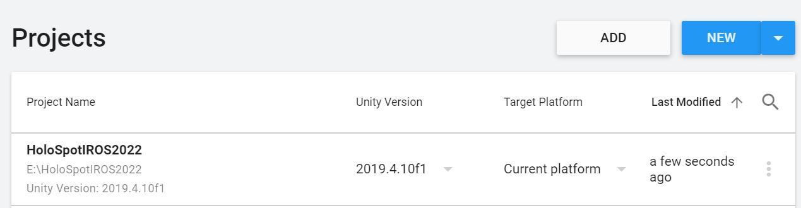
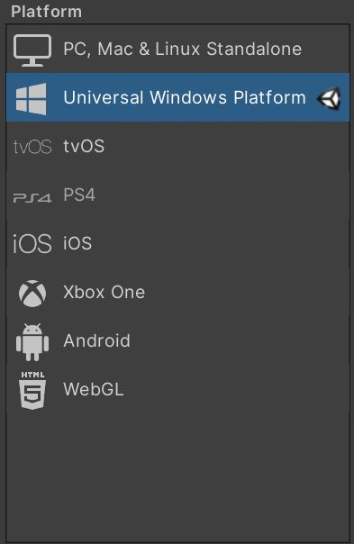
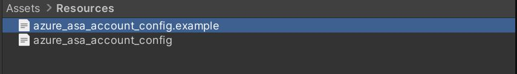
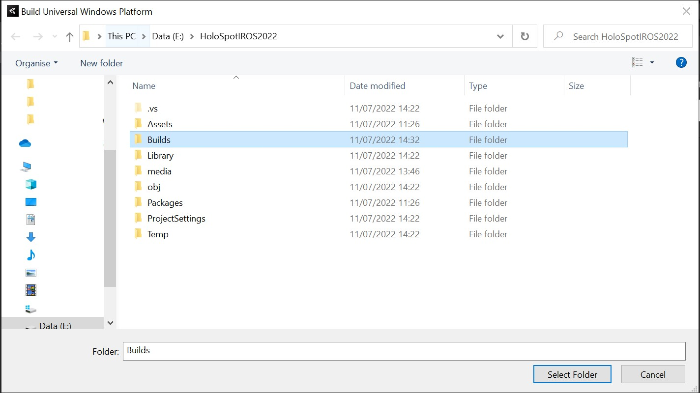
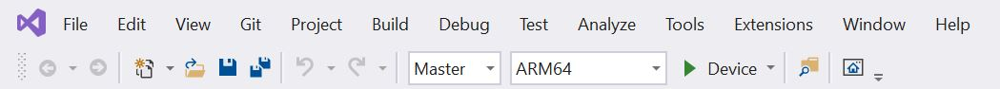
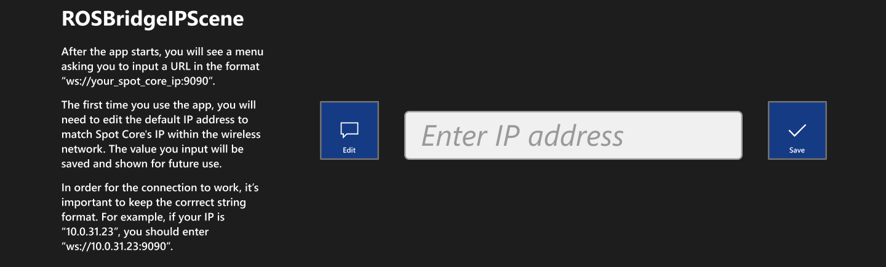

# Holo-Spot Unity App

## Required software 

* Unity GameEngine version 2019.4.10f1 with Universal Windows Platform Build Support.

## Prerequisites

* [Create a Spatial Anchors resource](https://docs.microsoft.com/en-us/azure/spatial-anchors/quickstarts/get-started-unity-hololens?tabs=azure-portal#create-a-spatial-anchors-resource)
    * Account Id:
    * Account Key:
    * Account Domain:

## Dependencies

This Unity app works together with the ROS packages included in this repository:

* [ROS packages](../ROSPackages/README.md)

## Deployment

This Unity app includes everything you need to deploy it straight away. Just make sure you installed the required version of Unity and follow these steps:

1. Clone this repository and add the UnityApp folder to your Unity Projects using Unity Hub. Double check you have the right Unity version.

2. Open the project and wait untill Unity finishes importing all the required packages. This could take a while.
3. Go to **File -> Build Settings** and change the target platform from **PC, Mac & Linux Standalone** to **Universal Windows Platform**.

4. The project uses 3 scenes:

    1. **ManagerScene**: Spawns the basic components needed to work with MRTK.
    2. **ROSBridgeIPScene**: Allows the user to input the URI of the Rosbridge websocket server.
    3. **MainScene**: Where all the functionality is included.

4. Close the **Build Settings** window and then go to **Assets -> Resources** folder and open *azure_asa_account_config.example*.
5. Enter the details associated to your asa resource (see prerequisites section) between the quotes and save your changes in a different file under the same directory (**Assets -> Resources**) by removing *.example* from its original name: *azure_asa_account_config*.
    * If you change the file directory or name from the ones stated above, you will also need to update *AsaJsonFileReader.cs* accordingly. Otherwise, the application won't work.

6. Build the Unity project
    * Select **File > Build Settings**
    * Click the **Build** button.
    * In the **Build Universal Windows Platform** window, navigate to the folder where you want to store your build, or create a new folder (e.g. Builds) and navigate to it, and then click the **Select Folder** button to start the build process (a progress bar appears to let you know how the build is proceeding.).

7. Deploy the application:
    * When the build process has completed, **Windows File Explorer** opens and displays the build folder. Navigate inside the folder and then double-click the solution file to open it in Visual Studio (2019 or 2022):
    * Configure Visual Studio for HoloLens by selecting the **Master** or **Release** configuration and the **ARM64** architecture.
    * Click the deployment target drop-down and then do one of the following:
        * If you're building and deploying via USB, select **Device**.
        * If you're building and deploying via Wi-Fi, select **Remote Machine**.
            * Set your remote connection: on the menu bar, select **Project > Properties**.
            * In the project's Property Pages window, select **Configuration Properties > Debugging**.
            * Click the **Debugger to launch** drop down and then select **Remote Machine** if it's not selected already.
            * In the **Machine Name** field, enter the IP address of your device. To find your IP address, on your HoloLens, go to **Settings > Updates & Security > For developers**. The IP address is listed towards the bottom of the window under **Ethernet**.
            * Set the **Authentication Mode** to **Universal (Unencrypted protocol)**.
    * Connect your HoloLens to your computer, and then in Visual Studio, do one of the following:
        * To deploy to your HoloLens and automatically start the app without the Visual Studio debugger attached, select **Debug > Start Without Debugging**.
        * To deploy to your HoloLens without having the app start automatically, select **Build > Deploy Solution**.
    * If you're using a Visual Studio version other than 2019, you'll also need to retarget the solution before deploying to the Hololens: `Project -> Retarget Solution -> OK`.

## Usage

1. After your app finishes building, in the HoloLens **Start** menu, find the app tile for your app, and then select it.
    * Spot Core and the HoloLens must be connected to the same wireless network. This network must have internet access.
2. After the app starts, you will see **ROSBridgeIPScene**:

3. At this point you will be in the **MainScene** and the following elements of the UI should be visible:
    * Anchor
    * Go-To marker 
    * Odom Frame
    * Menus

### Menus

### Create an ASA anchor

1. Move the cube (Anchor) to a different location (pinch/drag/unpinch to move it).
2. Using the **right hand menu**:
    * Start an Azure session.
    * Create an Azure anchor at the location of the cube.
    * Save the Anchor Id to disk
    * Remove the local anchor to allow the user to move the cube.
    * Move the cube somewhere else.
    * Get the Anchor Id from disk
    * Find the Azure anchor and verify that the position the cube is the same as the location from step 2.

3. After creating an ASA anchor in the previous step, use the **left hand menu** to publish the anchor id of the anchor you created, Spot needs it to colocalise with the HL2.
    * See [ROS Packages](../ROSPackages/README.md) for details on how to setup the colocalisation process.

## Interaction modes

When Spot and the HL2 are localised under the same global coordinate system you are ready to start interacting with Spot using AR. We provide two different interaction modes in this application:

## Other repositories used

The following is a list of repositiories that we found useful to build our application:

|Name     | Link     | Version    | Licence     |
| :------------- | :----------: | :----------: | ---------: |
| Mixed Reality Toolkit | [Microsoft/MRTK](https://github.com/microsoft/MixedRealityToolkit-Unity/releases/tag/v2.5.3) | v2.5.3 | MIT |
| ROS Sharp | [EricVoll/ros-sharp](https://github.com/EricVoll/ros-sharp) | master (April 2022) | Apache-2.0| 
| mixed-reality-robot-interaction-demo |  [Microsoft/mixed-reality-robot-interaction-demo](https://github.com/microsoft/mixed-reality-robot-interaction-demo) | main (April 2022) | MIT |

## Troubleshooting

* If you get an error when building your app in Unity (something related to WSATestCertificate having expired), go to UnityApp/Assets and delete the certificate. Then try again.

* If you get an error while trying to deploy the app using a cable (something like the device actively refusing the connection), try deploying the app using the "Remote machine" option first.

* If after creating an ASA anchor you cannot find it, check that your HL has internet access. Alternatively, you can check that you are actually creating anchors by checking the dashboard of your ASA resource for recently created anchors. If you don't see any, check your internet connection and your ASA resource credentials.